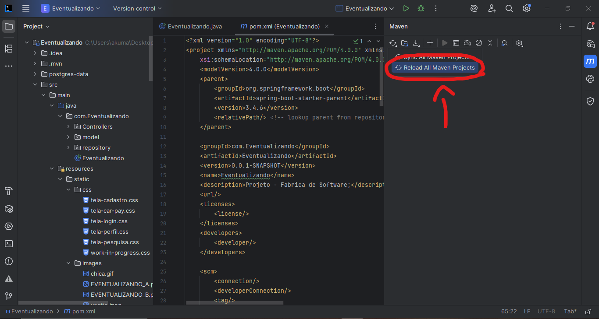
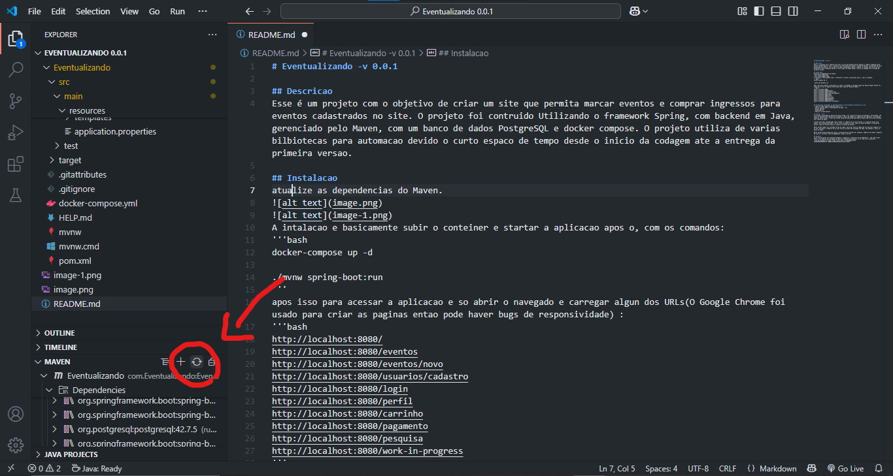

# Eventualizando -v 0.0.1

## Descricao
Esse é um projeto com o objetivo de criar um site que permita marcar eventos e comprar ingressos para eventos cadastrados no site. O projeto foi contruido Utilizando o framework Spring, com backend em Java, gerenciado pelo Maven, com um banco de dados PostgreSQL e docker compose. O projeto utiliza de varias bilbiotecas para automacao devido o curto espaco de tempo desde o inicio da codagem ate a entrega da primeira versao.

## Instalacao
atualize as dependencias do Maven.

A intalacao basicamente é subir o conteiner e startar a aplicacao, com os comandos: 

- docker-compose up -d 
- ./mvnw spring-boot:run  
Para finalizar a aplicacao é so dar um 'Ctrl + c'.  
apos isso para acessar a aplicacao e so abrir o navegado e carregar algun dos URLs(O Google Chrome foi usado para criar as paginas entao pode haver bugs de responsividade) : 

http://localhost:8080/ 
http://localhost:8080/eventos 
http://localhost:8080/eventos/novo 
http://localhost:8080/usuarios/cadastro 
http://localhost:8080/login 
http://localhost:8080/perfil 
http://localhost:8080/carrinho 
http://localhost:8080/pagamento 
http://localhost:8080/pesquisa 
http://localhost:8080/work-in-progress

## Ferramentas utilizadas no desenvolvimento e possivelmente necessarias no uso
- IntelliJ IDEA Community Edition 2025.1.1.1 
- JDK 24 (minimo para o funcionamento do app v- 17) 
- Docker Desktop 
- PostgreSQL 17
- Node.js (e bibliotecas) 
- SpringBoot 3.5.0 
- Maven 
As dependencias estao listadas na documentacao 

## vercao - 0.0.1
A principal prioridade da aplicação nesta versão é ter a base do projeto estruturada e funcionando, sem levar em consideração requisitos funcionais, regras de negócio ou requisitos de segurança. O principal objetivo desta versão é criar uma versão visual da aplicação que tenha ao menos uma função que interaja com o banco de dados.  

A parte funcional implementada nesta versão é o cadastro de um novo evento e a interação deste novo evento com a página principal - Ao se criar um evento ele será salvo no banco de dados e a aplicação buscará todos os eventos salvos e exibira na página de eventos. 

Nesta versão também foi iniciada função de login, porém por fata de tempo não foi possível completá-lo, só está funcional o cadastro de um novo usuário no qual não interage com nada, tão somente é salvo no banco de dados. 

Nesta versão estão disponíveis para a visualização as páginas de: Pesquisa, Cadastro de evento, Cadastro de usuário, Carrinho, Tela de pagamentos, Login e Perfil; 

## Contribuintes
- JOÃO VICTOR D. PIMENTA - Fabrcia de Software I e II 
- DIOGO MENDES VILELA - Fabrcia de Software I e II 
- CARLOS ALBERTO DE QUEIROZ JUNIOR - Fabrcia de Software I  
- RAFAEL GOMES PIMENTEL - Fabrcia de Software I  
- SÉRGIO BRAZ DE REZENDE FILHO - Fabrcia de Software I e II

## Objetivo 
Criar uma aplicação com interface amigavel, responsiva, interativa que assemelha-se à uma rede social.
(Este é um trabalho de faculdade das matérias Fabrica de software I e II, sem fins lucrativos)
(link do documento no Word: https://1drv.ms/w/c/72828cb064cbe2f4/ETooOFdQPUlMnqOy2Cf9-_8BND9v41ZUKkAz69ZaPz4k-g?e=716bfZ)
